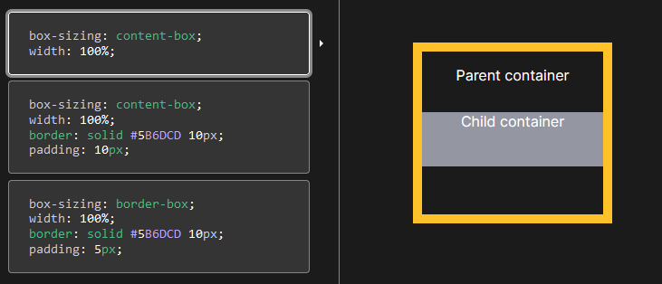
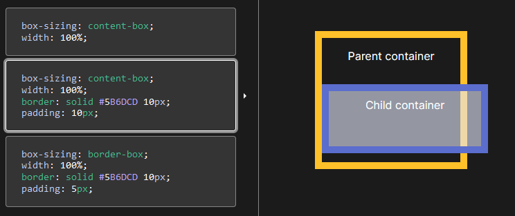
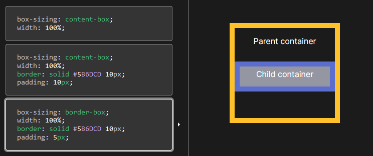
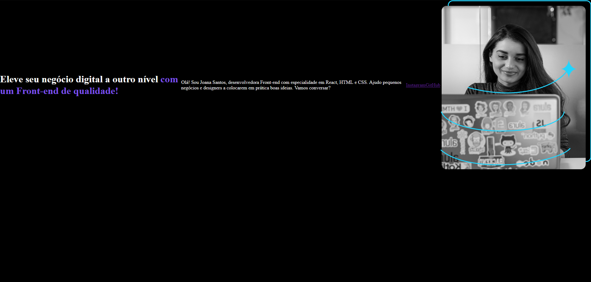
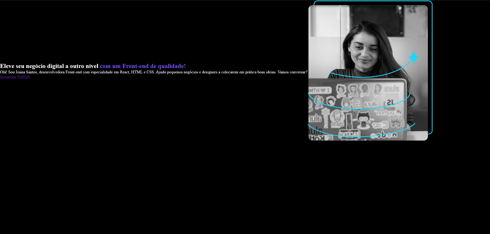
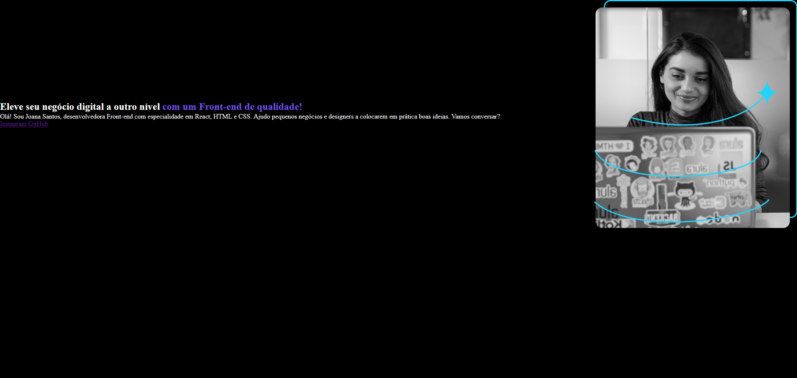

# Anotações referente ao curso "HTML e CSS: Classes, posicionamento e Flexbox" - **Finalizado**
Objetivo do curso: Aprender mais sobre CSS.

---
## Aula 01 - Seletores e posicionamento

### **Classes**:

No CSS as classes servem para definir um conteudo especifico para alterar em vez da tag em geral:

```HTML
--------------------------------------------------------
Sem usar classes:

CSS:

p {
    color: blue;
}

HTML:

<p>Sem o uso de clase esse texto</p>
<p>e esse, ficam completamente azuis</p>
--------------------------------------------------------
Usando classes:

CSS:

.texto-azul {
    color: blue;
}

HTML

<p class="texto-azul">Com o uso de classes esse texto fica em azul</p>
<p>mas esse aqui continua na cor padrão</p>
--------------------------------------------------------
```
<br>

### **Box model**:


Por padrão coisas como por exemplo a margem ja são pré feitos, então um bom costume é sempre resetar esses numeros com o seguinte codigo:
```CSS
* {
    margin: 0;
    padding: 0;
}
```
O simbolo "*" significa que estou puxando **TODAS** as tag e alterando todas ao mesmo tempo.

---

## Aula 02 - Posicionando mais elemetos

### **Height (Altura)**:
```CSS
body {
    height: 100vh;
} 
```
Faz com que a altura do Body seja equivalente a 100% da altura da view port (tamanho da tela)
<br>
VH = view height (altura da view port)
<br>
<br>
Box-sizing:
<br>
Imagem representa o conteudo dentro do "pai"

Exemplo de tag "pai" e "filho":
```HTML
<body>
    <p>Nesse Exemplo o "body" é a tag pai da tag "p"</p>
</body>
```
Nessa imagem o conteudo de uma tag "filho" esta saindo de dentro da tag "pai"

Porém, usando "border-box" em vez de "content-box" vemos que o tamanho do conteudo é reduzido automaticamente, para ficar dentro da tag "pai"


### **Flex-Box**:
Ele é usado para posicionar os elementos de todos os "filhos" da tag em que foi colocado.
```CSS
.apresentacao {
    display: flex;
}
```
Nesse caso todos os elementos filhos da Classe "apresentacao" vão ser posicionados com base no Flex-box (por padrão o "flex" faz com que todos os elementos fiquem alinhados horizontalmente)

### **Align-items**:

Serve para alinhar todo o conteudo.
```CSS
.apresentacao {
    display: flex;
    align-items: center;
}
```
Dessa forma todo o conteudo fica centralizado ja que o align-items foi definido como "center", porém, o center alinha com base o alinhamento do proprio conteudo

Como nesse exemplo que o align-items centralizou o conteudo mas não conforme a pagina toda e sim conforme o proprio conteudo, ou seja, centralizou baseado na imagem.

---

## Aula 03 - Estilos de texto e fontes
### **Section**:
Ele cria uma sessão, para separar o conteudo, como por exemplo:
```HTML
<section>
    <h1>Eleve seu negócio digital a outro nível <strong class="titulo-destaque">com um Front-end de qualidade!</strong></h1>
    <p>Olá! Sou Joana Santos, desenvolvedora Front-end com especialidadeem React, HTML e CSS. Ajudo pequenos negócios e designers a colocaremem prática boas ideias. Vamos conversar?</p>
    <a href="https://www.instagram.com/bruno.h_a/">Instagram</a>
    <a href="https://github.com/BrunoHeA">GitHub</a>
</section>
    
```

Nesse exemplo o section separou todo o texto da imagem, fazendo com que em vez de tudo estar junto e misturado, a gente separa em "blocos" um com os textos no section e outro com a imagem sem o section.

Separando com o section, o resultado do Flex-box ja muda, por que por padrão ele deixa todo o conteudo "filho" alinhados horizontalmente, o que fazia com que todos os textos ficassem um do lado do outro, mas com o **section** os textos ja não são mais filhos do flex-box, então ele não vai mais deixar os textos alinhados horizontalmente o que resulta em:



Agora todos os textos estão um abaixo do outro.

### **Space-between**
Separa o conteudo "filho", assim como no exemplo:

```CSS
.apresentacao {
    display: flex;
    align-items: center;
    justify-content: space-between;
}
```
Que resulta em:


## Aula 04 - Manipulando botões
### **Div**
Serve assim como o section para separar os conteudos, porém, o div não tem significado para o navegador, então não é bom usar com coisas importantes e sim para coisas pequenas ou apenas visuais.

### **Border-radius**
Serve para definir o raio da borda.

### **Padding**
```CSS
padding: 21.5px 0;
```
o primeiro valor serve para definir o valor Vertical e o segundo serve para o Horizontal.

### **text-decoration**
```CSS
text-decoration: none;
```
remove decorações do texto, como por exemplo o sublinhado que vem como padrão nos hiperlinks.

### **font-family**
Define a font que vai ser usada.

## Aula 05 - Ajustando o espaçamento

### **flex-direction**
Muda o padrão do flex-box de deixar o conteudo alinhado horizontalmente.

### **gap**
Parecido com o margin, muda a distancia.