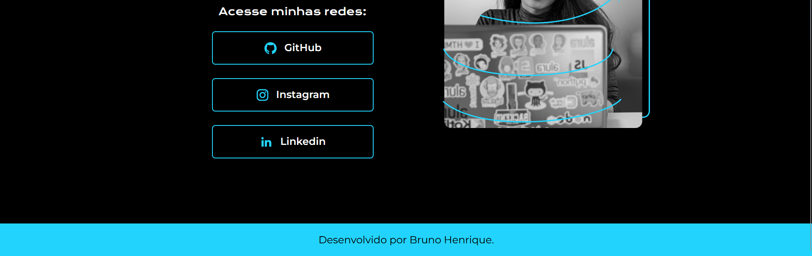

# Anotações referente ao curso "HTML e CSS: cabeçalho, footer e variáveis CSS" - **Finalizado**

Projeto refente ao seguinte repositorio: [Repositorio](https://github.com/BrunoHeA/HTML-e-CSS-ambientes-de-desenvolvimento)

---

## Aula 01 - Preparando o layout do projeto

Nada de novo nessa aula apenas estilizando de outro modo coisas ja vistas.

---

## Aula 02 - Criando icones clicáveis

### **Hover**

Hover é bem parecido com o "place_meeting" em GML, basicamente significa que o mouse está por cima do conteudo, fazendo com que seja possivel estilizar de um jeito diferente do convencional, como por exemplo:

```CSS
.apresentacao__conteudo__links__link {
    /* background-color: aqua; */
    display: flex;
    justify-content: center;
    gap: 16px;
    border: 2px solid aqua;
    width: 378px;
    text-align: center;
    border-radius: 8px;
    font-size: 24px;
    font-weight: 600;
    padding: 21.5px 0;
    text-decoration: none;
    color: white;
    font-family: 'Montserrat', sans-serif;
}

.apresentacao__conteudo__links__link:hover {
    background-color: #272727;
    gap: 8px;
    color: aqua
}
```
Basicamente a estilização sem o hover é a estilização padrão do conteudo, porém, quando o mouse passa por cima do conteudo a estilização do Hover ganha prioridade, fazendo com que ela mude. Em GML teriamos o mesmo resultado com o seguinte codigo:

```GML
//No objeto do "botão"
if place_meeting(mouse_y, mouse_y, self) {
    back_color = make_color_rgb(27,27,27)
    draw_set_halign = fa_left
    draw_set_colour(c_aqua)
}
```

---

## Aula 03 - Criando header e footer

Tentei criar o rodapé de um jeito proprio com as coisas ja aprendidas. E sai um resultado visual bem satisfatorio para mim:


com o seguinte codigo:

HTML:
```HTML
<footer class="rodape">

<p><b><a class="rodape__link" href="#">Desenvolvido por Bruno Henrique.</a></b></p>

</footer>
```

CSS:
```CSS
.rodape {
    font-family: 'Montserrat', sans-serif;
    display: flex;
    justify-content: center;
    align-items: center;
    color: black;
    height: 80px;
    background-color: aqua;
}

.rodape__link {
    text-decoration: none;
    color: black;
}
```
Resultado no curso:



Codigo que foi utilizado no curso:

HTML:
```HTML
<footer class="rodape">

    <p>Desenvolvido por Bruno Henrique.</p>

</footer>
```

CSS:
```CSS
.rodape {
    font-family: 'Montserrat', sans-serif;
    font-weight: 400;
    font-size: 24px;
    text-align: center;
    color: black;
    padding: 24px;
    background-color: #22D4FD;
}
```

## **Nav**

é uma tag usada para indicar uma sessão de links para navegação no proprio site, como por exemplo um botão para ir a uma pagina "sobre mim" no site ou voltar para o home.

---

## Aula 04 - Navegando entre páginas

Nada de novo nessa aula apenas estilizando a nova pagina e ensinando a importancia de ter o minimo de arquivos possiveis para melhor performance do site

---

## Aula 05 - Aplicando variaveis CSS

### **Variaveis**
Variaveis assim como em todas as outras linguagens é apenas um lugar para armazenar informações, porém, o jeito de declarar as variaveis é bem diferente das que eu conheço, como por exemplo em GML.

No CSS o jeito de declarar variaveis é assim:

```CSS
/* Variavel local */
.body {
    --color-text: #F6F6F6;
    color: var(--color-text);
}

/* Variavel Global */
:root {
    --color-text: #F6F6F6;
}

.body {
    color: var(--color-text)
}
```

Ja em GML (que é como sempre fui acostumado) é:

```GML
// Variavel temporaria

var color_text = make_color_rgb(F6,F6,F6)

draw_set_color(color_text)

// Variavel Local

color_text = make_color_rgb(F6,F6,F6)

draw_set_color(color_text)

// Variavel Global

global.color_text = make_color_rgb(F6,F6,F6)

draw_set_color(global.color_text)

```