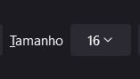

# Anotações referente ao curso "HTML e CSS: trabalhando com responsividade e publicação de projetos" - **Finalizado**

Projeto refente ao seguinte repositorio: [Repositorio](https://github.com/BrunoHeA/HTML-e-CSS-ambientes-de-desenvolvimento)

---
## Aula 01 - Unidades de medidas

### **Grupos de medidas**

Existem 2 grandes grupos de medidas:

Absolutas que são medidas que não se alteram, então independente do tamanho da tela do usuario o valor vai ser sempre o mesmo, como por exemplo:

px <br>
cm <br>
mm <br>
in

Relativas que são medidas que se adaptam a tela do usuario, como por exemplo:

% <br>
em <br>
ex <br>
ch <br>
rem <br>
vh <br>
vw

### **Rem**

O rem serve para acompanhar a unidade de medida do proprio navegador, se adatando a qualquer tamanho padrão do navegador como por exemplo:



Usando o rem o site vai se adaptar a qualquer tamanho não importando se esta com o tamanho 16 ou qualquer outro, ja o px ele fica naquele valor fixo sem se adaptar ao navegador.

```CSS
/* Aqui o tamanho da fonte não se adapta ao usuario, sendo sempre 32 pixels */
font-size: 32px;

/* Aqui o resultado é exatamente o mesmo, porém, ele se adapta ao usuario */
font-size: 2rem;

/* OBS: 1rem = 16px, 2rem = 32px. 3rem = 48px... */
```

---
## Aula 02 - Adaptando elementos

### **Porcentagem**

A porcentagem funcina dentro do espaço da tag pai, como por exemplo:

```HTML
<body>
    
</body>
```
Nesse exemplo caso a imagem seja alterada usando porcentagem como aumentando a margem para 10%, ele vai usar como parametro o tamanho da tag pai, ou seja, 10% de todo o espaço da tag body

---
## Aula 03 - Responsividade

### **Media Queries**

Com o @media, podemos mudar a estilização dependendo do tamanho da tela, como por exemplo:

```CSS
@media (max-width: 1200px) {
    .apresentacao {
        flex-direction: column;
    }
}
```

Aqui, caso a tela seja menor que 1200 pixels, a estilização da classe apresentacao ira mudar para o "flex-direction: column", isso é util para deixar tudo mais bonito em celulares.

---
## Aula 04 - Responsividade e GitHub
Nada de novo nessa aula somente explicação sobre o que é o github e criando conta.

---
## Aula 05 - Repositório no GitHub
Nada de novo nessa aula somente explicação sobre como criar e o que é repositórios.